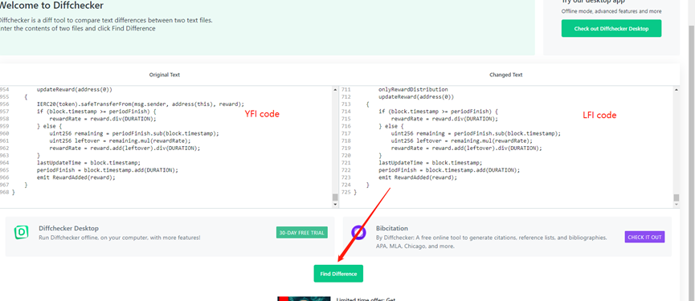
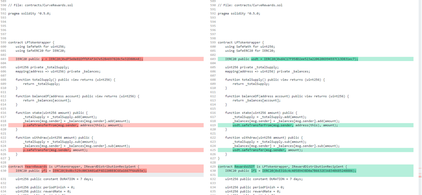

#                   
                  合约代码对比指南——避免恶意合约盗走您的本金

## 1.智能合约的代码安全性至关重要

部分挖矿合约存在恶意代码，能随时提走你的本金。千万不要贪图日化10%的收益，而被盗走所有本金，您一定要学会判断智能合约代码是否安全。

## 2. 如何判断合约的安全性？
第一步：找出已审计的合约代码，例如YFI、YFII等合约代码，此类已被各大知名机构审计，不存在任何后门。YFI矿池合约代码地址为（红框里所有代码即为合约源码）：
https://etherscan.io/address/0x0001fb050fe7312791bf6475b96569d83f695c9f#code
 

第二步：找出您准备去挖矿的智能合约代码，对比其与YFI合约的不同之处。LFI矿池合约代码地址为： 
https://etherscan.io/address/0xa81331893f2f9a59f7e5fab29fe7f246fa477059#code   
     
第三步：打开https://www.diffchecker.com/，将YFI与LFI代码分别粘贴到左右各框，点”Find Difference”，即可看到颜色标记的不同之处。
 

若挖矿的合约代码只是修改了变量名称（例如YFI改成LFI）、修改代币ERC20地址、修改挖矿开始时间，那就是安全的。若发现合约代码增加了很多段函数，那就一定要小心了。
（下图LFI代码安全，仅改动了代币名称和挖矿开始时间，确保头矿人人均有机会参与）

